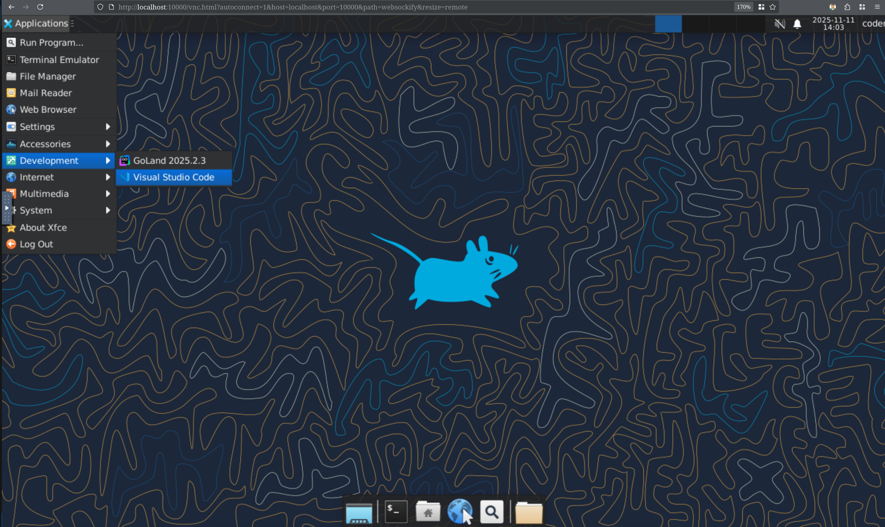

# CodingBooth WorkSpace

**Current Version:** v0.11.0 — [View Changelog](CHANGELOG.md)

CodingBooth WorkSpace delivers fully reproducible, Docker-powered development environments — anywhere, on any machine.
You’ve containerized your app. You’ve containerized your build.
But your development environment? Still a mess of system-wide installs, mismatched versions, and onboarding docs no one reads.

**WorkSpace** fixes that.

With WorkSpace, you can run your IDE, shell, or even an entire Linux desktop inside a container — perfectly mapped to your host user (no root-owned files, no permission headaches). Every developer on your team gets the same consistent environment with zero setup friction.

Whether you want a browser-based VS Code session, a Jupyter notebook environment, or a complete XFCE/KDE desktop accessible through your browser — the WorkSpace images and launcher script make it effortless.

**Result:** a clean, consistent, portable development experience that just works.

# Table of Contents
- [Quick Try](#quick-try)
- [Installation](#installation)
- [CLI Usage](#cli-usage)
- [Why WorkSpace?](#why-workspace)
- [Variants](#variants)
- [Built-in Tools](#built-in-tools)
- [Quick Examples](#quick-examples)
- [Customization](#customization)
- [Guarantees & Limits](#guarantees--limits)
- [How It Works](#how-it-works)
- [`workspace` Manual](#workspace-manual)
- [Setup Implementation Notes](#setup-implementation-notes)
- [Community & Feedback](#community-feedback)

## Quick Try

1. Ensure you have Docker installed and running.
2. Clone this repo.
3. cd into it and cd further into `examples/go-example` or any other example in that folder.
4. Run : `../../workspace`
5. Wait for a few minutes (may be more for the first run) and visit `http://localhost:10000`
6. Select your IDE and start coding! (note: your code will be in `/home/coder/workspace` folder).



### Optional
7. Inspect `.ws/Dockerfile` and `.ws/config.toml` inside `examples/go-example` and
    see if you can figure out what they are.
8. Try other [examples](https://github.com/NawaMan/WorkSpace/tree/latest/examples) or different [variants](https://github.com/NawaMan/WorkSpace/tree/latest?tab=readme-ov-file#available-variants).
9. Try on your own project,
  1. Run: `curl -fsSL https://github.com/NawaMan/WorkSpace/releases/download/latest/ws | bash`
  2. Create `.ws/Dockerfile` and `.ws/config.toml` -- Take inspiration from the existing [examples](https://github.com/NawaMan/WorkSpace/tree/latest/examples).

## Installation

Run the following on the project **base folder** to install [CodingBooth WorkSpace Wrapper](https://github.com/NawaMan/WorkSpaceWrapper).
The wrapper allows management of the workspace script file.

```shell
curl -fsSL https://github.com/NawaMan/WorkSpace/releases/download/latest/ws | bash
```

Run the wrapper script and follow the instructions.

```shell
./ws
```

## CLI Usage

WorkSpace provides a command-line interface with the following structure:

```shell
./workspace [flags] [-- command...]
```

### Common Flags

| Flag | Description |
|------|-------------|
| `--variant <name>` | Select container variant (base, notebook, codeserver, desktop-xfce, desktop-kde) |
| `--version <tag>` | Specify image version tag (default: latest) |
| `--name <name>` | Set container name |
| `--port <port>` | Set host port mapping (number, NEXT, or RANDOM) |
| `--daemon` | Run container in background |
| `--pull` | Force pull latest image |
| `--dind` | Enable Docker-in-Docker mode |
| `--keep-alive` | Keep container after exit |
| `--silence-build` | Suppress build/startup output |
| `--dryrun` | Print docker commands without executing |
| `--verbose` | Enable debug output |
| `--config <path>` | Use custom config file |
| `--workspace <path>` | Set workspace directory |
| `--help`, `-h` | Show help information |

### Examples

```shell
# Start with default settings (interactive shell)
./workspace

# Start VS Code in browser
./workspace --variant codeserver

# Run a command and exit
./workspace -- make test

# Start in background with custom port
./workspace --daemon --port 8080

# Dry-run to see what would be executed
./workspace --dryrun --verbose
```

## Why WorkSpace?

When developing inside containers, files you create often end up owned by the container’s user (usually `root`).  
This leads to frustrating permission issues on the host — you can’t easily edit, remove, or commit those files without resorting to `sudo` or other workarounds.

**WorkSpace** solves this by mapping the container’s user to **your host UID and GID**.  
That means every file you create or modify inside the container is **owned by you on the host** — just as if it were created directly on your local machine.


### What This Gives You

- **Seamless file access** – Create, edit, and delete files inside the container, then use them on the host with no permission issues.  
- **Team-friendly** – Each developer uses their own UID and GID mapping — no more “root-owned” repositories.  
- **Project isolation** – Keep toolchains and dependencies inside the container while working directly in your project folder.  
- **Portable configuration** – `.ws/config.toml` travel with your repository, ensuring consistent setups across machines.


## Variants

WorkSpace provides several **ready-to-use container variants** designed for different development workflows.
Each variant comes pre-configured with a curated toolset and a consistent runtime environment.

### Available Variants

- **`base`** – A minimal base image with essential shell tools.  
  Ideal for building custom environments, running CLI applications, or lightweight automation tasks.
  The terminal is expose with [ttyd](https://github.com/tsl0922/ttyd) on port 10000.

- **`ide-notebook`** – Includes [Jupyter Notebook](https://jupyter.org/) with Bash and other utilities.  
  Great for data science, analytics, documentation, or interactive scripting workflows.

- **`ide-codeserver`** – A web-based VS Code environment powered by [`code-server`](https://github.com/coder/code-server).  
  Provides a full browser-accessible IDE with Git integration, terminals, and extensions.

- **[`desktop-xfce`]( https://www.xfce.org  )**, **[`desktop-kde`]( https://kde.org/plasma-desktop)** – Full Linux desktop environments accessible via browser or remote desktop (e.g., [noVNC](https://novnc.com)).  
  Useful for GUI-heavy workflows or running native IDEs like [IntelliJ IDEA](https://www.jetbrains.com/idea/), [PyCharm](https://www.jetbrains.com/pycharm/), or [Eclipse](https://www.eclipse.org) inside Docker.

All variants expose its UI on port 10000 but NEXT and RANDOM can be use. See [Port](#6-ports) for more details. 

### Aliases & Defaults

WorkSpace supports several shortcuts and aliases for variant names:

| Input Alias	| Resolved Variant |
|-------------|------------------|
| default	    | ide-codeserver   |
| console     | base             |
| ide	        | ide-codeserver   |
| notebook    | ide-notebook     |
| codeserver  | ide-codeserver   |
| desktop	    | desktop-xfce     |
| xfce        | desktop-xfce     |
| kde	        | desktop-kde      |

If an unknown value is provided, WorkSpace will exit with an error listing supported variants and aliases.

### Desktop Configuration

For desktop variants (`desktop-xfce`, `desktop-kde`), you can customize the screen resolution by setting the `GEOMETRY` environment variable.

**Default:** `1280x800`

**Example (command line):**
```bash
./workspace --variant desktop-xfce -e GEOMETRY=1920x1080
```

**Example (in `.ws/config.toml`):**
```toml
run-args = ["-e", "GEOMETRY=1920x1080"]
```

#### noVNC Resize Modes

When accessing the desktop through your browser, noVNC supports different resize modes:

- **`remote`** (default) – Dynamically resizes the remote desktop to match your browser window size. The `GEOMETRY` setting becomes the initial size.
- **`scale`** – Scales the desktop to fit your browser window while maintaining the resolution set by `GEOMETRY`.
- **`off`** – No resizing or scaling; displays the desktop at native resolution (1:1 pixel mapping).

To use a specific resize mode, append `&resize=off` or `&resize=scale` to the noVNC URL:
```
http://localhost:10000/vnc.html?autoconnect=1&host=localhost&port=10000&path=websockify&resize=off
```

> 💡 **Tip:** If you set a specific resolution like `1920x1080`, you may want to use `resize=off` to see it at native resolution, or `resize=scale` to fit it within your browser window.

### Typical Use Cases

- **Data Science & Notebooks** – Quickly spin up reproducible Jupyter environments using `--variant notebook`.  
  Ideal for experiments, reports, or teaching interactive examples.

- **Executable Bash Notebooks** – Use `--variant notebook` to work in a Jupyter environment that includes a **Bash kernel**.
  This allows you to write notebooks that mix explanations, commands, and output in one place — effectively turning a notebook into a runnable document.
  It's ideal for creating repeatable build instructions, walkthroughs, tutorials, or Makefile-like automation that is much more readable and approachable than shell scripts alone.

- **Web or App Development** – Develop directly in a browser-based IDE using `--variant codeserver`, complete with terminal and Git integration.

- **Lightweight CLI Workflows** – Use `--variant base` for scripting, building, and testing in an isolated but fast shell environment.

- **GUI Development Environments** – Run full desktop IDEs or graphical tools using `--variant desktop-*`.  
  Perfect for complex projects requiring a windowed environment without polluting your host.

- **Continuous Integration & Training** – Standardize development or CI environments for teams and classrooms, ensuring consistent behavior across machines.

---

> 💡 **Tip:** You can override the variant at runtime using:
> ```bash
> ./workspace --variant codeserver
> ```
> Or set it permanently in your configuration file (`.ws/config.toml`).


## Built-in Tools

Every WorkSpace image comes with a carefully selected set of command-line tools for productivity, scripting, and troubleshooting.  
These essentials are preinstalled so you can start working immediately — no extra setup required.

### 🧰 Included Tool Categories

- **Shells & Process Management**  
  `bash`, `zsh`, `tini`

- **Networking & Transfers**  
  `curl`, `wget`, `httpie`

- **Source Control & GitHub Integration**  
  `git`, `gh` (GitHub CLI), `tig`

- **Editors & File Browsers**  
  `nano`, `tilde`, `ranger`, `less`

- **Data Processing & Formatting**  
  `jq`, `yq`, `tree`

- **Compression & Archiving**  
  `unzip`, `zip`, `xz-utils`

- **System Utilities**  
  `ca-certificates`, `locales`, `sudo`

---

> 💡 **Tip:** Each variant extends this base toolset — for example,  
> `notebook` adds Jupyter, and `codeserver` adds a web-based IDE.  
> You can also customize your setup by adding additional packages in your Dockerfile.


## Quick Examples

```shell
./workspace -- make test
```

```shell
./workspace -- 'read -r -p "Press Enter to continue..."'
```

More examples : https://github.com/NawaMan/WorkSpace/tree/main/examples


## Customization

You can tailor how WorkSpace runs by adjusting configuration files or using runtime flags:

- **`.ws/config.toml`** – Defines the image name, variant, UID/GID overrides, and default ports.  
- **Runtime flags** – Options such as `--variant`, `--name`, `--pull`, `--dryrun`, and others can override defaults at launch.

> 💡 **Tip:** Configuration precedence follows this order:  
> **CLI flags → config file → environment variables → built-in defaults.**
> **Bootstrap note:** `--workspace` and `--config` are evaluated early (CLI first pass or defaults) and are not overridden by environment variables/TOML configuration file.

#### The `.ws/` Folder

All workspace configuration lives in a single `.ws/` folder in your project root:

```
my-project/
└── .ws/
    ├── config.toml     # Launcher configuration
    ├── Dockerfile      # Custom Docker build (optional)
    ├── home/           # Team-shared home directory files (optional)
    │   └── .config/
    └── tools/          # Managed by ws wrapper (auto-created)
        └── workspace
```

| File | Purpose |
|------|---------|
| `config.toml` | Defines variant, ports, run-args, build-args, cmds |
| `Dockerfile` | Custom image build extending a base variant |
| `home/` | Team-shared dotfiles copied to `/home/coder/` at startup |

> ⚠️ **Note on `cmds`:** When you pass commands via CLI (`-- <cmd>`), they **override** the `cmds` in config.toml (they don't append).

---

## Guarantees & Limits

- ✅ **Host file ownership:** All files in your project folder remain owned by your host user — no "root-owned" files.
- ✅ **Consistent user mapping:** Each container automatically creates a matching user and group via `workspace-user-setup`.
- ⚠️ **Cross-OS caveats:** WorkSpace doesn't abstract away all host OS differences — things like line endings, symlinks, or file attributes may still vary between platforms.

### JetBrains IDE Licensing in Containers

JetBrains activation is stored as a machine-specific token. When you run an IDE backend inside a container, a fresh container may be treated as a new machine, so you may be asked to sign in again unless IDE state is persisted.

**Recommended approaches:**
- **JetBrains Gateway (preferred):** license checked on your local machine; container backend doesn't store license data.
- **Persistent volumes:** mount configs/caches/plugins if you run a full GUI IDE inside the container.
- **License Vault:** for short-lived containers / multi-machine scenarios.

---

## How It Works

1. The launcher passes your **host UID** and **GID** into the container using the environment variables `HOST_UID` and `HOST_GID`.  
2. Inside the container, the entrypoint script (`workspace-user-setup`) ensures a matching `coder` user and group exist with those IDs.  
3. The directories `/home/coder` and `/home/coder/workspace` are owned by that user, ensuring smooth file sharing between host and container.  
4. Add the user `coder` to sudoers so that it can sudo without needing the password
5. Prepare `.bashrc` and `.zshrc`
6. Run startup script (files in `/etc/startup.d`)
7. All commands run as the unprivileged **`coder`** user, not `cdroot`, preserving security and consistent file ownership.


```
host                                 # your machine
  ├── project/                       # your project folder on the host
  |    ├── ws                        # workspace wrapper script
  |    ├── .ws                       # workspace internal folder
  |    |    ├── tools                # workspace tools folder
  |    |        └── workspace        # workspace runner script
  |    ├── ...                       # other project files
  ...

container
  ├── home/
  |    ├── coder/
  |    |    ├── workspace/                # your project folder inside the container
  |    |    |   ├── ws                    # workspace wrapper script
  |    |    |   ├── .ws                   # workspace internal folder
  |    |    |   |    ├── tools            # workspace tools folder
  |    |    |   |    └── workspace        # workspace runner script
  |    |    ├── ...                       # other project files
  |    ├── ...                            # other home files
  ├── etc/
  |    ├── profile.d/                     # profile script folder
  ├── opt/
  |    ├── workspace/
  |    |    ├── setups/                   # setup script folder
  |    |    |    ├── ...                  # setup scripts
  ├── usr/
  |    ├── local/
  |    |    ├── bin/                      # program file folder
  |    ├── share/
  |    |    ├── startup.d/                # startup script folder
  ...
```

---

> 🧠 **In short:**  
> WorkSpace mirrors your host identity inside the container — you work as yourself, not as root.


**Result:** seamless dev environment, no permission headaches.

---

> 📝 **Technical Note:**  
> WorkSpace uses the Docker CLI (`docker` command) rather than Docker client libraries.  
> This keeps the codebase simple, portable, and easier to maintain while ensuring compatibility across platforms.

### Home Directory Customization

WorkSpace provides two mechanisms for populating the user's home directory with custom files at container startup:

#### Project Home Folder (`.ws/home/`)

Create a `.ws/home/` folder in your project to share team-wide dotfiles, tool configs, or shell customizations.

**How it works:**
- Place files in `.ws/home/` with the same structure as `$HOME`
- At container startup, files are copied to `/home/coder/` without overwriting existing files
- The folder should be version-controlled (committed to git)

**Example structure:**
```
my-project/
├── .ws/config.toml
├── .ws/Dockerfile
└── .ws/home/
    ├── .bashrc              # Team bashrc additions
    ├── .config/
    │   └── nvim/
    │       └── init.lua     # Shared neovim config
    └── .gitconfig           # Team git settings
```

> ⚠️ **Warning:**  
> Do NOT put secrets, credentials, or personal tokens in `.ws/home/` — this folder is meant to be committed to version control and shared with your team.

#### Home Seed Directory (`/tmp/ws-home-seed/`)

Mount host files read-only to `/tmp/ws-home-seed/` for **personal credentials** that should not be version-controlled.

**How it works:**
1. Mount host files read-only to `/tmp/ws-home-seed/` (preserving the relative path structure)
2. At container startup, files are copied to `/home/coder/` without overwriting existing files
3. The user gets a writable copy; the host's original files stay protected

**Example (`.ws/config.toml`):**
```toml
run-args = [
    "-v", "~/.config/gcloud:/tmp/ws-home-seed/.config/gcloud:ro",
    "-v", "~/.config/github-copilot:/tmp/ws-home-seed/.config/github-copilot:ro"
]
```

**Use cases:**
- **Credentials** — gcloud, GitHub Copilot, SSH keys (apps may refresh tokens)
- **Personal IDE settings** — VS Code, IntelliJ configurations
- **Personal dotfiles** — `.bashrc`, `.gitconfig` customizations

#### Precedence Order

Files are copied in this order (later sources win if the file doesn't exist yet):

1. **`.ws/home/`** (project folder) — Team-shared defaults
2. **`/tmp/ws-home-seed/`** (host mounts) — Personal credentials & preferences
3. **Existing files** — Already in `/home/coder/` are preserved

Since all copies use `cp -rn` (no-clobber), the first source to create a file "wins".  
In practice: host-mounted files in `ws-home-seed` override project defaults in `.ws/home`.

> 💡 **Tip:**  
> Use `.ws/home/` for team configs (neovim, linters, shell aliases).  
> Use `ws-home-seed` for personal credentials (gcloud, SSH keys, API tokens).


## workspace Manual

### Feature List

### 1. Image Selection

**Defaults**
- **Repository:** `nawaman/workspace`  
- **Variant:** `base`  
- **Version:** `latest`

**Overrides**
- **Environment variables:** `IMAGE_NAME`, `IMAGE_REPO`, `IMAGE_TAG`, `VARIANT`, `VERSION`  
- **Configuration file:** `.ws/config.toml`  
- **CLI options:** `--variant`, `--version`, `--image`, `--dockerfile`

**Precedence**
Command-line arguments → config file → environment variables → built-in defaults

> **Bootstrap note:** `--workspace` and `--config` are resolved from CLI (first pass) or defaults, and are not overridden by the config file or environment variables.


**Derived Values**
- `IMAGE_NAME` = `IMAGE_REPO:IMAGE_TAG`  
- `IMAGE_TAG` = defaults to `${VARIANT}-${VERSION}`  

> 💡 **Tip:**  
> When both `--image` and `--dockerfile` are provided, `--image` takes precedence.  
> Use `--dockerfile` when you want to build locally; otherwise, WorkSpace automatically pulls prebuilt images from `nawaman/workspace`.


### 2. Container Name

**Default**  
- The container name defaults to a sanitized version of the current folder name.  
  If the directory name cannot be determined, it falls back to `workspace`.

**Overrides**
- **Environment variable:** `CONTAINER_NAME`  
- **Configuration file:** `.ws/config.toml`  
- **CLI option:** `--name <name>`

---

> 💡 **Tip:**  
> Using unique container names helps avoid conflicts when running multiple WorkSpace instances simultaneously.


### 3. Config Files

WorkSpace supports several configuration files that control how containers are built and launched.  
These files let you define defaults, environment variables, and runtime parameters without cluttering your CLI commands.

#### **Launcher Config (`.ws/config.toml`)**
- Loaded after bootstrap flags are determined (`--workspace`, `--config`) and before full CLI parsing.
- Defines default values for image selection, user mapping, and runtime behavior.
- Typical keys include:
  `variant`, `version`, `image`, `dockerfile`,
  `name`, `host-uid`, `host-gid`, `port`, `dind`, and others.

##### **Custom Argument Arrays**
You can define three special arrays in `.ws/config.toml` to customize how the launcher interacts with Docker:

- **`common-args`** – Pre-applied CLI flags merged before command-line parameters.
  Useful for predefining commonly used options (e.g., extra ports or mounts).
  ```toml
  common-args = ["--variant", "ide-codeserver", "--port", "8080"]
  ```

These behave exactly like command-line flags passed to workspace.

- **`build-args`** – Extra args for `docker build` when dockerfile is used.
  For example, disable caching or pass build-time variables:
  ```toml
  build-args = ["--no-cache", "--build-arg", "NODE_VERSION=20"]
  ```
- **`run-args`** – Extra args for `docker run`.
  These are appended automatically at launch:
  ```toml
  run-args = ["-e", "TZ=Asia/Bangkok", "-v", "/mnt/data:/data"]
  ```
- **`cmds`** – Default command to run inside the container.
  Note: CLI `-- <cmd>` overrides this (does not append):
  ```toml
  cmds = ["bash", "-lc", "make test"]
  ```

> 💡 Tip:
> These arrays allow you to version-control useful runtime and build options without hardcoding them into your CLI workflow.
> Combined with `common-args`, you can achieve fully reproducible builds and launches with zero manual typing.

#### Container Environment File (.env)
- Passed directly to Docker using the `--env-file` option.
- Commonly used for credentials or runtime configuration such as: `PASSWORD`, `JUPYTER_TOKEN`, `TZ`, `PROXY`, `AWS_*`, `GH_TOKEN`, etc.
- Can be overridden with `env-file = "<path>"` in config.toml.
- To disable, set `env-file = "none"` in config.toml.

> 🧩 Summary:
> Configuration layers allow customization at two levels:
> Build+Image: .ws/config.toml (persistent project defaults)
> Container Environment: .env (runtime secrets and environment variables)
> Together, they give you full control over build, run, and launcher behavior.


### 4. Host UID/GID Handling

WorkSpace ensures that all files created inside the container are owned by the same user and group as on your host system.  
This eliminates the common “root-owned files” problem when developing inside Docker.

**Defaults**
- Automatically detects and uses your current user and group IDs:
  ```bash
  HOST_UID=$(id -u)
  HOST_GID=$(id -g)
  ```

### 5. Run Modes

WorkSpace supports multiple run modes to fit different workflows — from one-off commands to long-running containers.

#### **Interactive Shell (Default)**
- Launches an interactive terminal session inside the container.  
- The container is removed automatically when you exit.
  ```bash
  docker run --rm -it ... $IMAGE_NAME
  ```
- Ideal for local development, testing, or exploratory use.

#### Command Mode (-- <cmd>)
- Executes a specific command inside the container and then exits.
- Commands are run under a login shell for a consistent environment:
  ```bash
  ./workspace -- echo "Hello from container"
  ```
- Useful for automation, scripting, or CI/CD pipelines.

#### Silent Mode (--silence-build)
- Suppresses container startup messages for a cleaner output.
- Ideal when you want commands to appear as if they're running locally:
  ```bash
  ./workspace --variant base --silence-build -- echo "Hello"
  # Output: Hello
  ```
- Combine with command mode to integrate workspace commands into scripts or pipelines where only the command output matters.

> ⚠️ **Note:**  
> Silent mode only hides startup messages — the container still needs time to build (if using a custom Dockerfile) and start up.  
> First runs or cold starts may take several seconds to minutes depending on image pull/build requirements.
  
#### Daemon Mode (--daemon)
- Starts the container in the background (detached).
- For the container variant, the container runs an infinite sleep loop to stay alive.
- Commonly used for IDE variants (like codeserver or desktop-*) that provide persistent services.

> 💡 **Tip:**  
> In daemon mode, you can later attach to the container using:
> `docker exec -it <container_name> bash`
> Stop it with:
> `docker stop <container_name>`

### 6. Ports
WorkSpace automatically manages host ↔ container port mappings for interactive and web-based variants.

**Defaults Behavior**
For the notebook and codeserver variants, the container exposes port 10000, which is mapped to:

  ```bash
  ${WORKSPACE_PORT:-NEXT}:10000
  ```

Meaning:
- The launcher will search for the first available host port ≥ 10000
- It tries 10000 → 10001 → 10002 → … until it finds a free port


**Overrides**
- You can customize the exposed port via:
  - Environment variable: WORKSPACE_PORT
  - Configuration file: .ws/config.toml
  - CLI flag: --port <number>
- The value can be a fixed number (8080), NEXT (to find the next available port), or RANDOM (to assign a random open port).

> 💡 Tip:
> When using multiple WorkSpace containers at once, consider setting WORKSPACE_PORT=NEXT to avoid conflicts automatically.

### 7. Pulling Images

WorkSpace manages Docker image retrieval intelligently to balance performance and consistency.

**Default Behavior**
- If the specified image does not exist locally, WorkSpace will **automatically pull** it from the configured repository.  
- If the image is already present, it reuses the local copy for faster startup.

**Forced Pull**
- Use the `--pull` flag to explicitly fetch the latest image version, even if a local copy exists:
  ```bash
  ./workspace --pull
  ```
> 💡 Tip:
> Use --pull periodically to ensure your local environment stays in sync with the latest base image, especially when sharing configurations across teams.


### 8. Dry-Run Mode

The **dry-run** mode allows you to preview exactly what WorkSpace will execute — without actually starting a container.

**Usage**
```bash
./workspace --dryrun
```

**Behavior**
- Prints the fully assembled docker run ... command that would be executed.
- No side effects — it does not check Docker status, pull images, or create containers.
- Useful for debugging configuration issues or verifying CLI overrides before launch.

> 💡 Tip:
> Combine --dryrun with --verbose to see detailed variable expansion and runtime configuration.

### 9. Keep Alive
Keep the container around after it stop.
- By default, once the container stop, it will be removed.
- By using `--keep-alive`, the container will be kept around.
- User can re-start the container using: `docker start <container-name>`.
- To remove the **stop** container use: `docker rm <container-name>`.
- To save the current state of a container as a new image:
  ```bash
  docker commit <container-name> <new-image-name>:<tag>
  ```
  > Useful if you made changes inside the container and want to keep them for future use.
- To save an image to a file (for backup or sharing):
  ```bash
  docker save -o <file-name>.tar <image-name>:<tag>
  ```
  > Example: `docker save -o myapp.tar my-image:v1`
- To load a previously saved image file:
  ```bash
  docker load -i <file-name>.tar
  ```
- To export a container’s filesystem as a .tar file:
  ```bash
  docker export -o <file-name>.tar <container-name>
  ```
  > This saves the filesystem only (no image metadata or history).
- To import the exported container back as a new image:
  ```bash
  cat <file-name>.tar | docker import - <new-image-name>:<tag>
  ```
- There are more things you can do with stopped containers, please consult docker documentation for more information.

### 10. Help

Displays detailed usage information, supported flags, and configuration notes.

**Usage**
```bash
./workspace --help
# or
./workspace -h
```

**Behavior**
- Prints a full help summary including available variants, runtime options, and examples.
- Provides hints for environment variables and configuration file structure.
- Exits immediately after displaying help.

### 11. Docker-in-Docker (DinD) Support

WorkSpace supports **Docker-in-Docker (DinD)** mode, allowing you to build and run Docker containers **from inside your workspace container**.  
This feature is useful for CI/CD pipelines, containerized builds, or development environments that need access to Docker tooling.

---

**Behavior**
- When DinD mode is enabled, the workspace container gains access to the host’s Docker daemon or runs its own isolated Docker service.  
- The mode can operate in one of two styles:
  1. **Socket sharing (default):** Mounts the host's Docker socket (`/var/run/docker.sock`) for direct access.
  2. **Sidecar DinD service:** Starts a secondary "sidecar" container running the Docker daemon itself.

---

**How It Works (Sidecar Mode)**

When DinD is enabled with the sidecar approach, the launcher:

1. **Creates a dedicated network** — `{container-name}-{port}-dind-net`
2. **Starts a DinD sidecar** — A `docker:dind` container runs the Docker daemon
3. **Shares network namespace** — The workspace uses `--network container:{dind}` so `localhost` refers to the sidecar
4. **Configures Docker access** — Sets `DOCKER_HOST=tcp://localhost:2375`

```
Host
└── Docker
    ├── DinD sidecar container
    │   └── Docker daemon (:2375)
    │       └── (your containers run here)
    └── Workspace container
        ├── shares DinD's network (localhost = DinD)
        └── DOCKER_HOST=tcp://localhost:2375
```

This allows the workspace to run Docker commands that execute inside the isolated DinD environment.

---

**Configuration**
- Enable DinD by setting:
  ```bash
  DIND=true
  ```
  in your .ws/config.toml file or by passing:
  ```bash
  ./workspace --dind
  ```
- Default behavior (DIND=false) disables Docker access inside the container.
  
**Usage Notes**
- DinD mode may increase resource usage and startup time.
- The sidecar approach offers stronger isolation but can be slower and more complex to manage.

> 💡 **Tip:**
> See `examples/dind-example` for basic DinD usage, or `examples/kind-example` for running Kubernetes with KinD inside the workspace.


## Setup Implementation Notes
Setup scripts are scripts that install tools and dependencies.
Not every tool or dependency needs a setup script.
A basic `apt-get install ....` or `curl ...` can be be used.
A setup script may be required, if a tool or dependency requires:
- user specific configuration
- custom bash session (such as environmental variables)
- a starter wrapper
- requires other tools or dependencies that need a setup script.

### Setup Files Overview

WorkSpace setup scripts follow a simple pattern that produces **three artifacts**:

1. **Startup script** (runs once per container start, as the normal user)  
   - Path: `/usr/share/startup.d/<LEVEL>-ws-<thing>--startup.sh`  
   - Purpose: one-time initialization per container boot (idempotent).  
   - Example tasks: create user cache dirs, generate config files if missing, first-run migrations.

2. **Profile script** (sourced at the beginning of every shell session)  
   - Path: `/etc/profile.d/<LEVEL>-ws-<thing>--profile.sh`  
   - Purpose: lightweight per-shell setup.  
   - Example tasks: export env vars, update `PATH`, define aliases.

3. **Starter wrapper** (a user-invoked command wrapper)  
   - Path: `/usr/local/bin/<thing>`  
   - Purpose: pre-/post-steps around the real tool, then `exec` the tool.  apt
   - Example tasks: set tool-specific env, ensure background service is running, sanitize args.

> 🧩 **From the template**  
> - Replace `XXXXXX` with your feature/tool name (e.g., `python`, `codeserver`).  
> - Adjust `LEVEL` (see **Profile Ordering** below).  
> - Use `envsubst` placeholders (e.g., `$XXXXXX_VERSION`) to stamp values into generated files.  
> - Make startup/profile code **idempotent** (safe to run multiple times).

---

### Startup/Profile Ordering

Name your scripts using this pattern:  
`/etc/profile.d/<LEVEL>-ws-<thing>--profile.sh` and `/etc/startup.d/<LEVEL>-ws-<thing>--startup.sh`

Choose `<LEVEL>` from these ranges to keep load order predictable:

| Level Range | Purpose |
|---|---|
| **50–54** | Core WorkSpace base setup |
| **55–59** | OS / UI setup (desktop, display, browsers) |
| **60–64** | Language / platform setup (Python, Java, Node.js, Go, etc.) |
| **65–69** | Language / platform extensions (venv managers, JDK tools, linters) |
| **70–74** | Developer tools (IDEs, editors, notebook servers) |
| **75–79** | Tool extensions (plugins, kernels, IDE extensions) |

> 💡 **Guideline:** Prefer **lower** levels for prerequisites and **higher** levels for dependents.  
> For example, install Python at **60–64**, then add Jupyter kernels at **75–79**.

---

### Setup Pattern & Conventions

**Script naming**
- Installation script (run as root): `*setup.sh` (placed in a build or image layer)
- Generated files (by the setup script):  
  - Startup: `/etc/startup.d/<LEVEL>-ws-<thing>--startup.sh`  
  - Profile: `/etc/profile.d/<LEVEL>-ws-<thing>--profile.sh`  
  - Starter: `/usr/local/bin/<thing>`

**Root vs. user**
- The *setup script itself* runs as **root** (installs packages, writes system files).  
- **Startup** and **profile** scripts run as the **normal user** at container start or shell login, respectively.

**Idempotence**
- Startup/profile code must be safe to run multiple times.  
- Use a sentinel when needed:
  ```bash
  SENTINEL="$HOME/.<thing>-startup-done"
  [[ -f "$SENTINEL" ]] && exit 0
  touch "$SENTINEL"

**Environment variables**
- Prefer the WS_* prefix for WorkSpace-specific variables (e.g., WS_PYTHON_HOME).
- In profile scripts, keep exports lightweight and guarded:
  ```bash
  case ":$PATH:" in *":/usr/local/bin:"*) ;; *) export PATH="/usr/local/bin:$PATH";; esac
  ```

**Starter wrappers**
- Keep wrapper logic minimal and exec the real binary:
```bash
# /usr/local/bin/<thing>
# pre-steps...
exec /usr/local/bin/real-<thing> "$@"
```
- Exit non-zero on failure; avoid swallowing errors.

**File permissions**
- Startup: chmod 755
- Profile: chmod 644
- Starter: chmod 755

## Custom Setups
You can create your own setup scripts to install any tool you need.
Simply copy into your docker image and run it just like other setup scripts.


## Community & Feedback

WorkSpace is built to meet **real developer needs** — simple, reproducible, and flexible without unnecessary complexity.  
Your feedback and contributions help it evolve and stay relevant for everyone.

---

### 🐛 Issues & Contributions
- Use the **[Issues page](../../issues)** to report bugs, request new features, or suggest improvements.  
- Pull Requests are always welcome — from fixing typos to adding new setup scripts or container variants.  
- Have a creative idea, workflow, or enhancement to share? Open an issue or discussion — we’d love to hear it.  
- Prefer to reach out directly? Feel free to contact me through any of the links below.

---

### ☕ Support & Appreciation
If WorkSpace has saved you time, simplified your setup, or made development more enjoyable —  
you can **[buy me a coffee](https://buymeacoffee.com/NawaMan)** to show your support.  

Your encouragement keeps this project active — and might even help with my kids’ college fund 😄.

---

### 🌐 Connect
Stay in touch or follow updates, insights, and development notes:
- 🐦 Twitter/X: [@nawaman](https://x.com/nawaman)
- 💼 LinkedIn: [nawaman](https://www.linkedin.com/in/nawaman/)
- 📰 Blog: [nawaman.net/blog](https://nawaman.net/blog/)

---

> 🙏 Every issue, idea, and pull request — big or small — helps make WorkSpace better for everyone.  
> Thank you for being part of the community!


