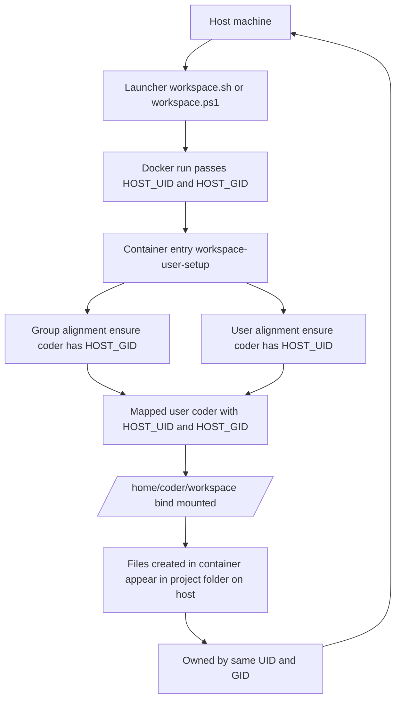

# WorkSpace

**WorkSpace** is a lightweight framework for running reproducible development environments inside Docker.

It provides simple launcher scripts --  `workspace.sh` for Bash/Linux/macOS
  and `workspace.ps1` for PowerShell/Windows -- that abstract away the messy parts of `docker run`.
Instead of memorizing long commands or maintaining complex Docker Compose setups, 
  you configure a few variables in `workspace.env` (image, variant, ports, etc.) and optional runtime tweaks in `workspace-docker.args`.
Then you can spin up a consistent workspace container with a single command.

## Why WorkSpace?

When you work inside a container, files you create often end up owned by the container’s user (frequently root).
That leads to annoying permission errors on the host: 
  you can’t edit, clean up, or commit those files without `sudo` gymnastics.

WorkSpace fixes that by mapping the container’s user to **your host UID/GID**,
  so everything you create or modify inside the container is **owned by you on the host**
  -- as if it came from the same machine.

### What this gives you
- **Seamless file access** – create/edit/delete files in the container; use them on the host with no permission surprises.
- **Team-friendly**        – every developer keeps their own UID/GID mapping -- no “root-owned” repos.
- **Project isolation**    – keep toolchains & deps in the container while working directly in your project folder.
- **Portable config**      – `workspace.env` and `workspace-docker.args` travel with your repo.

## Variants
WorkSpace provides **ready-to-use container variants** for common scenarios:
  - `container`  – minimal base with shell; bare but flexible.
  - `notebook`   – Jupyter Notebook + bash, useful for runnable notebooks and docs.
  - `codeserver` – Web-based VS Code (`code-server`) for full IDE in the browser.

Typical use cases include:
  - Most project + Easy on-boarding -- running Jupyter notebooks (VARIANT=notebook) and create often use operation scripte like build/test as notebooks.
  - Coding inside VS Code/code-server (VARIANT=codeserver).
  - Bare-bone development shells (VARIANT=container) where you can build on to customize as you need.
  - Isolated environments for cloud SDKs, CI builds, or teaching/training setups.

## Quick start

```shell
./workspace.sh -- make test
```


Windows (PowerShell):

```shell
.\workspace.ps1 -- make test
```

### Customization
  - `workspace.env` – image name, variant, UID/GID overrides, port defaults.
  - `workspace-docker.args` – extra `docker run` args (ports, mounts, env vars, memory limits).
  - Runtime flags – `--variant`, `--name`, `--pull`, `--dryrun`, etc.

## Guarantees & limits
  - ✅ Files in your project folder are always owned by your host user.
  - ✅ Idempotent user/group setup in the container (`workspace-user-setup`).
  - ⚠️ Does not abstract away all OS differences (line endings, symlinks, file attrs).

## How it works
  - The launcher passes your **host UID/GID** into the container (`HOST_UID`, `HOST_GID`).
  - The entry script (`workspace-user-setup`) ensures a coder user/group exists with those IDs.
  - Your home (`/home/coder`) and workspace (`/home/coder/workspace`) are owned by you.
  - Commands run as `coder`, not root.




Result: seamless dev environment, no permission headaches.


## workspace.sh and workspace.ps1 manual

### Feature List

1. Image Selection
  - **Defaults:**
    - Repo: `nawaman/workspace`
    - Variant: `container`
    - Version: `latest`
  - **Overrides:**
    - Env vars: `IMGNAME`, `IMGREPO`, `IMG_TAG`, `VARIANT`, `VERSION`
    - Config file: `workspace.env`
    - CLI options: --variant, --version
  - **Precedence:** CLI > config file > environment vars > built-in defaults.
  - **Derived:**
    - `IMGNAME` = `IMGREPO:IMG_TAG`
    - `IMG_TAG` = defaults to `VARIANT-VERSION`

2. Container Name
  - Default: sanitized current folder name (workspace if empty).
  - Overrides:
    - Env var: `CONTAINER`
    - Config file: `workspace.env`
    - CLI: `--name <name>`

3. Config Files`
  - **Launcher config (`workspace.env`)**
    - Sourced before parsing CLI.
    - Keys: `IMGNAME`, `IMGREPO`, `IMG_TAG`, `VARIANT`, `VERSION`, `CONTAINER`, `HOST_UID`, `HOST_GID`, `NOTEBOOK_PORT`, `CODESERVER_PORT`.
  - **Container env-file (`.env`)**
     - Passed with `--env-file`.
     - Typical keys: `PASSWORD`, `JUPYTER_TOKEN`, `TZ`, `AWS_*`, etc.
     - Override with `--env-file F` or `CONTAINER_ENV_FILE`.
   - **Docker args file (`workspace-docker.args`)**
     - Lines are parsed into extra docker run args.
     - Override with `--docker-args F` or `DOCKER_ARGS_FILE`.
     - Supports comments and quoted paths.

4. Host UID/GID Handling
  - Defaults: use `id -u`, `id -g`.
  - Override via env vars `HOST_UID`, `HOST_GID`, or config file.
  - Passed into container as envs.

5. Run Modes
  - **Interactive shell (default)**
    - `docker run --rm -it ... $IMGNAME`
  - **Command mode (`-- <cmd>`)**
    - Runs given command under `bash -lc`.
  - **Daemon mode (`-d` or `--daemon`)**
    - Detached container.
    - For `container` variant, runs an infinite sleep loop.

6. Ports
  - **Notebook** variant → publishes `${NOTEBOOK_PORT:-8888}:8888`
  - **CodeServer** variant → publishes `${NOTEBOOK_PORT:-8888}:8888` and `${CODESERVER_PORT:-8080}:8080`
  - All ports can be overridden in workspace.env.

7. Pulling Images
  - `--pull` forces a pull.
  - Otherwise, pulls if image missing.
  - Errors if image not found locally afterwards.

8. Container Cleanup
  - Automatically `docker rm -f` old container with same name before run.

9. Dry-Run Mode
  - `--dryrun` prints the fully assembled `docker run ...` command.
  - No side effects (no docker checks, no container run).

10. Help
   - `-h` / `--help` prints detailed usage, configuration, and notes.


## Community & feedback

WorkSpace aims to cover **typical developer needs** without overcomplicating things. 
If you find a gap, edge case, or improvement, please open an issue or PR -- we’d love to hear how you use it.
